This is my first static web !!!!

 

# 一、初步搭建

首先进入自己的GitHub账号界面


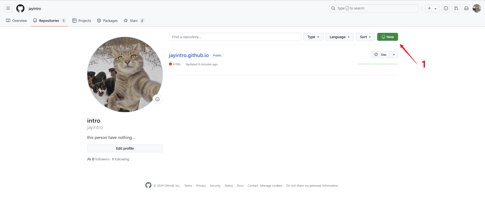


点击New后在下图的框中添加个人域名，格式为`<githubID>.github.io`

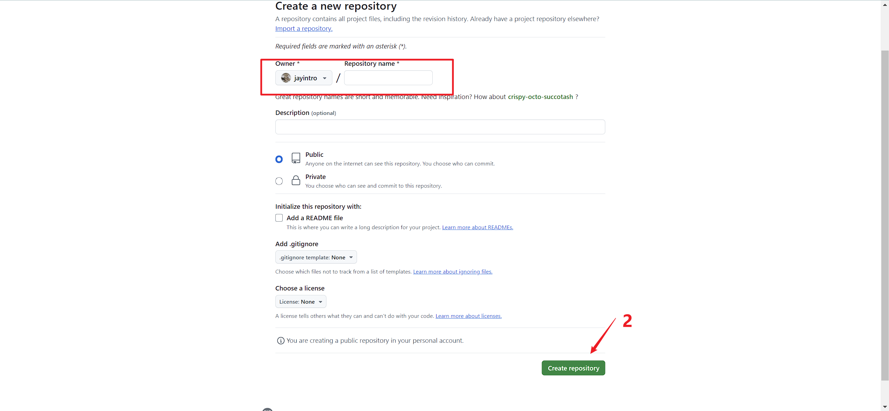
/assets/img/Pasted image 20240719105313.png

让后可以点击创建一个新文件进行后续的测试

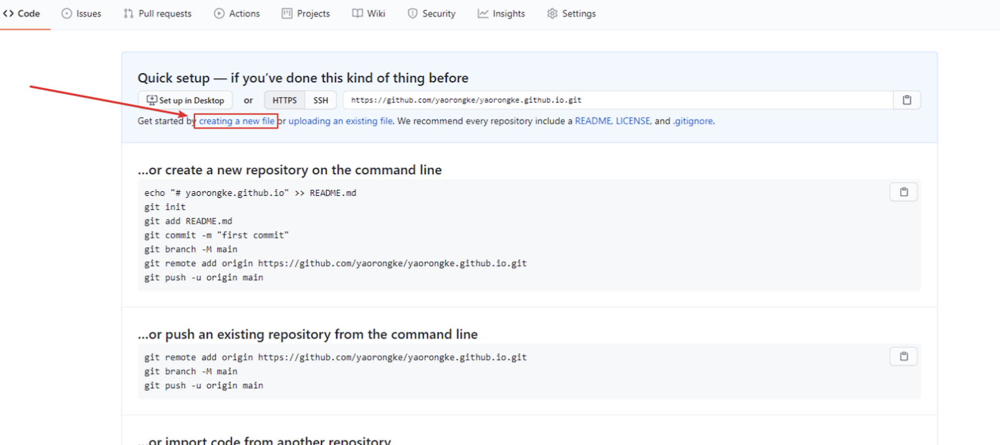

创建文件名为index.html，GitHub会自动解析此文件，测试代码如下：

```html
<!DOCTYPE html>
<html lang="en">
<head>
    <meta charset="UTF-8">
    <title>浮元子</title>
</head>
<body>
    <h1>浮元子的个人主页</h1>
    <h1>Hello ~</h1>
</body>
</html>
```

访问`https://jayintro.github.io/`的效果如下：

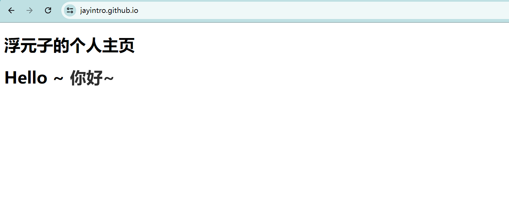

# 二、使用hydejack搭建网站

搭建参考官方文档：[hydejack](https://github.com/hydecorp/hydejack)

首先访问[hydejack-starter-kit](https://github.com/hydecorp/hydejack-starter-kit)，点击Fork将该仓库Fork到自己的GitHub下

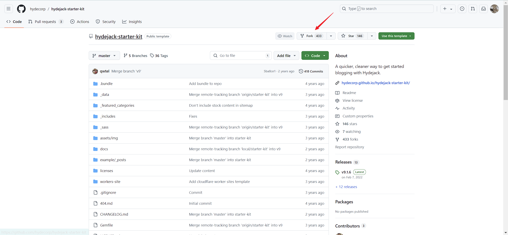

然后点击仓库下载链接，将仓库下载到本地。

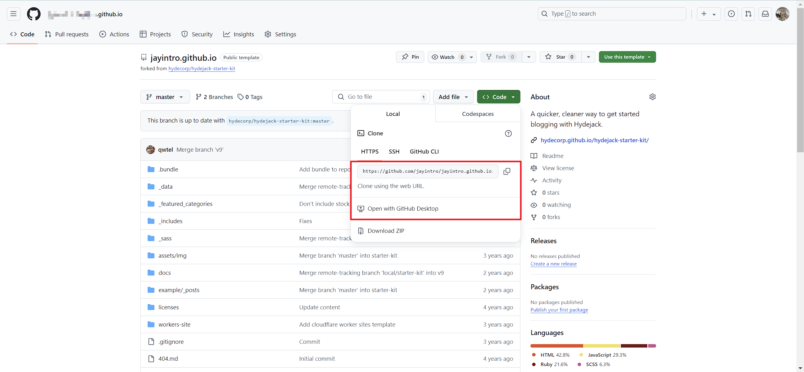

安装ruby，建议使用戴Devkit的版本，我下载了3.3.4版本，WindowsX64环境

[ruby安装位置](https://rubyinstaller.org/downloads/archives/)

然后在本地仓库中运行以下命令

```shell
bundle
```

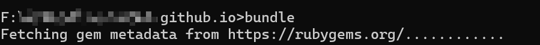

我这边运行到最后出现了这样一个问题

```ruby
# wdm 安装失败
# 报错提示如下👇
Gem::Ext::BuildError: ERROR: Failed to build gem native extension.
```

经过排查，ruby版本过高，所以选用了安装过程中目录提示到的ruby版本（3.3.0）

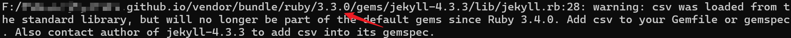

然后wdm被成功安装

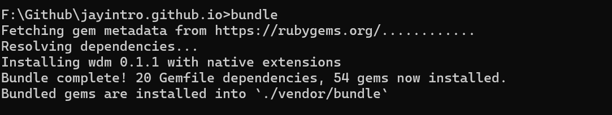

再运行如下命令，在本地开启网站服务进行测试

```shell
bundle exec jekyll serve
```

当看到如下界面说明本地服务已经起来

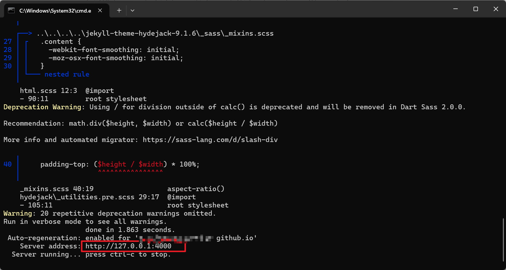

访问如下👇

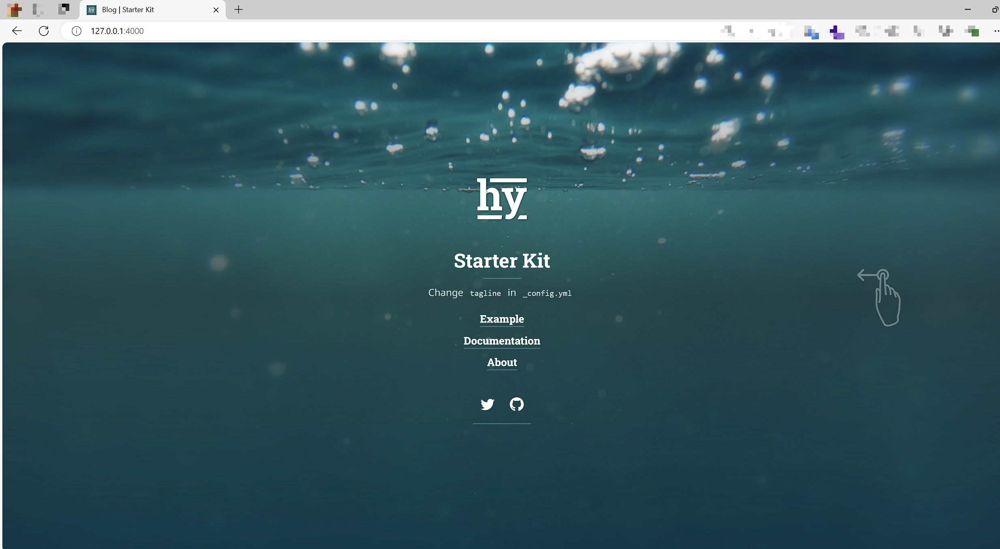

# 三、域名配置

首先得申请一个域名，我是从腾讯云申请了一个域名，youngfly.xyz

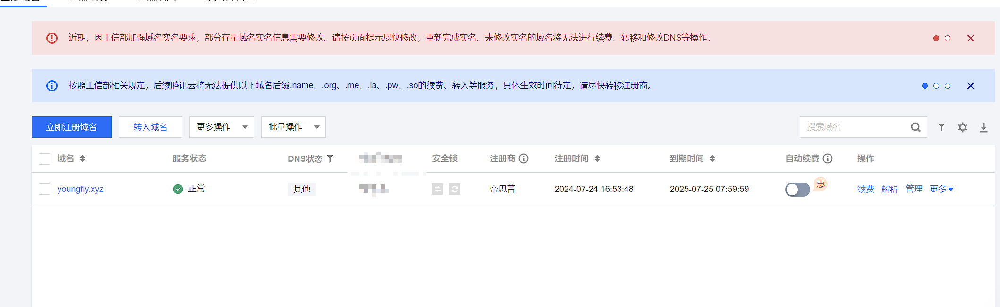

然后申请一个Cloudflare Dash账号，点击添加站点

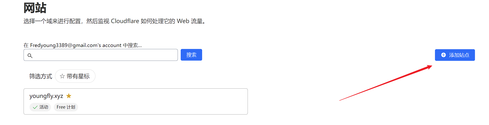

将腾讯云申请的域名添加进去

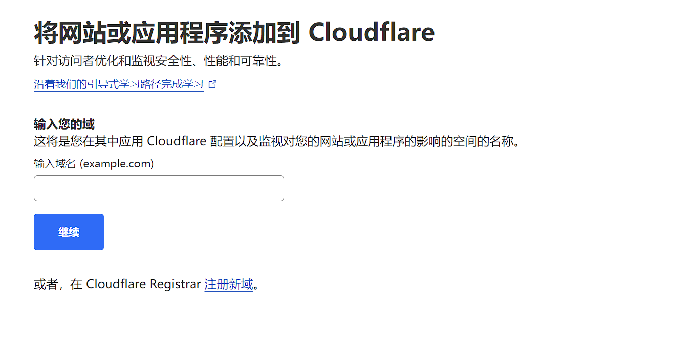

配置好DNS，其实从下面的IP中选择两个添加就行，我为了保险，直接都添加了

```text
185.199.111.153
185.199.110.153
185.199.109.153
185.199.108.153
```

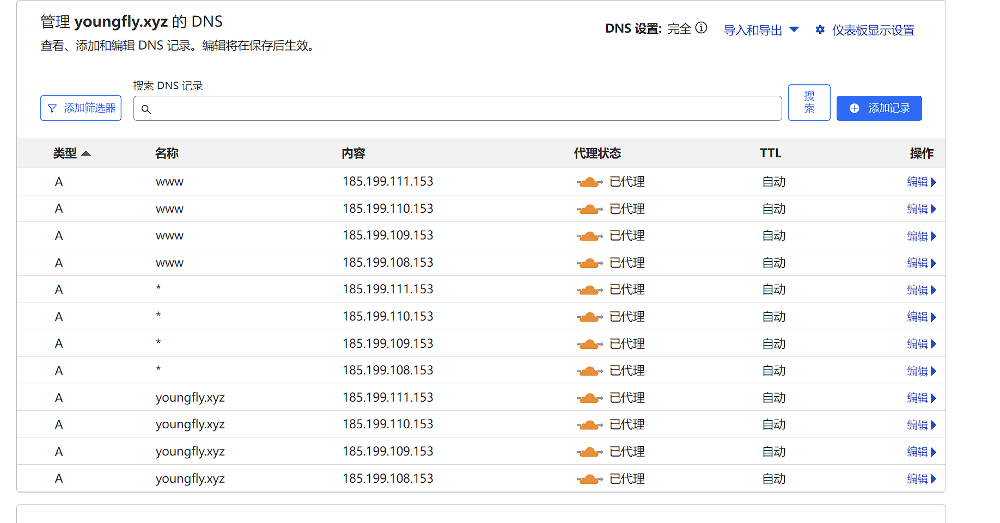

然后点击继续，cloudflare会分给你两个DNS域名服务器

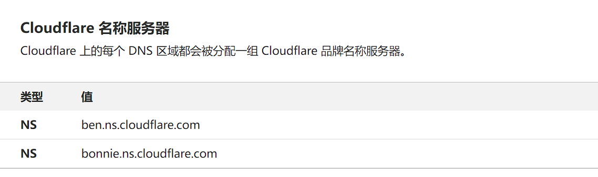


将这两个域名服务器的地址通过你的域名供应商提供的控制台进行替换（建议删除供应商提供的默认DNS域名服务器）

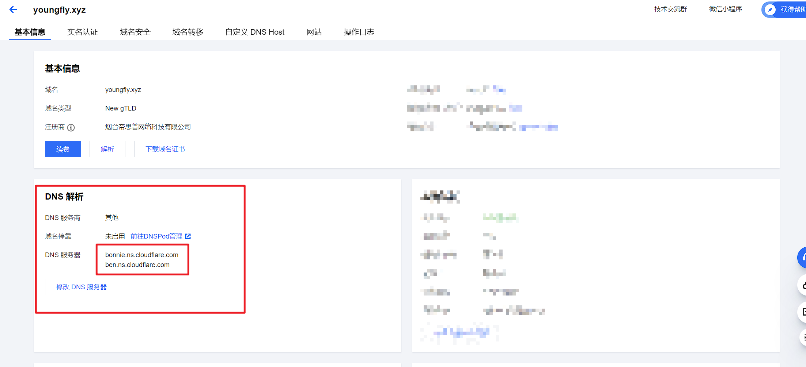

之后将域名添加到GitHub的自定义域名当中进行保存即可

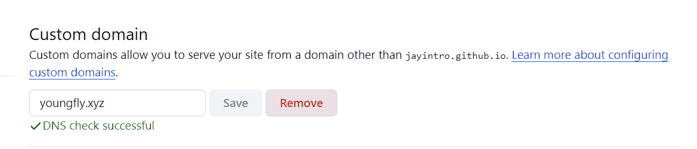

然后就能访问到自己的网站了

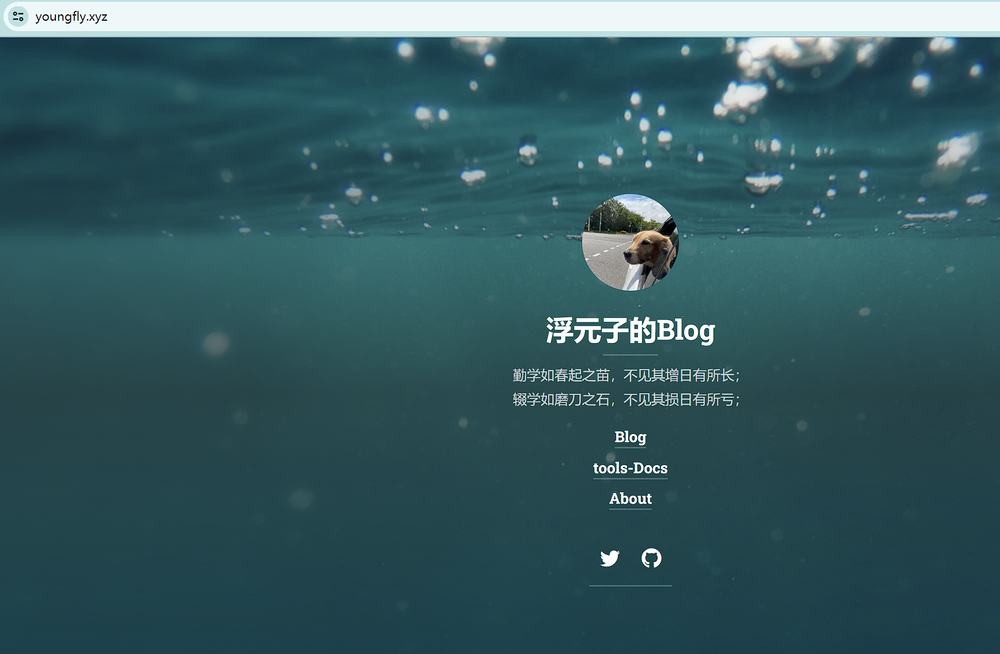

# 四、网站配置

这里官方文档讲的会更加清楚，建议详细阅读！！！

[官方指南](https://hydecorp.github.io/hydejack-starter-kit/)


